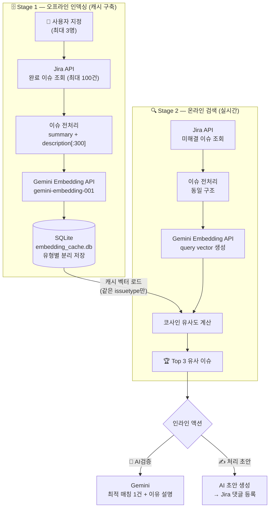

# sbe-jira-ui

Jira 업무 보조 웹 UI — AI 통합(Gemini / DevX AI), 유사이슈 검색, 처리 마법사, 안전 쿼리 생성

```bash
# 로컬 실행
python config_ui.py
# 브라우저: http://localhost:8765

# Docker 실행
docker compose up -d
```

---

## 화면 구성

사이드바 메뉴로 5개 페이지 전환 (SPA 방식, 빌드 스텝 없음)

```
┌─────────────┬──────────────────────────────────┐
│  sbe-jira   │                                  │
│             │     선택된 페이지 콘텐츠          │
│ ⚙ 환경설정  │                                  │
│ ─────────── │                                  │
│ 🤖 안내데스크│                                  │
│ 💬 Jira테스트│                                  │
│ 🔍 유사이슈  │                                  │
│ 🪄 처리마법사│                                  │
└─────────────┴──────────────────────────────────┘
```

---

## ⚙ 환경설정

Gemini / DevX AI 중 사용할 AI 제공자를 선택하고 연결 키를 관리합니다.

### AI 제공자 선택

| 제공자 | 용도 |
|--------|------|
| **Gemini** | 안내데스크 채팅, 유사이슈 AI검증, 처리 마법사 초안 생성 |
| **DevX AI** | 사내 DevX 에이전트 기반 처리 마법사 초안 생성, 안내데스크 채팅 |

> 유사이슈검색의 임베딩은 제공자 설정과 무관하게 항상 Gemini Embedding API를 사용합니다.

### Gemini 설정

| 항목 | 설명 |
|------|------|
| API Key | Google AI Studio에서 발급한 Gemini API 키 |
| 모델 | 사용할 Gemini 모델 (기본: gemini-2.5-flash) |
| ⚡ 상태 확인 | API 키 및 모델 유효 여부 즉시 확인 |

### DevX AI 설정

| 항목 | 설명 |
|------|------|
| API Key | DevX Portal에서 발급한 Bearer 토큰 |
| ⚡ 상태 확인 | DevX API 연결 상태 확인 (latency 표시) |

DevX 에이전트 코드는 `.env`에서 관리합니다:
```
DEVX_AGENT_REQUIREMENTS=custom_xxx   # 요건정의서
DEVX_AGENT_REVIEW=custom_xxx         # 변경검토회의록
DEVX_AGENT_TEST=custom_xxx           # 테스트시나리오
DEVX_AGENT_PROCEDURE=custom_xxx      # 배포절차서
DEVX_AGENT_APPROVAL=custom_xxx       # 배포결재서
DEVX_AGENT_SR=custom_xxx             # SR 처리내역
DEVX_AGENT_SAFE_QUERY=custom_xxx     # 안전 쿼리 도우미
DEVX_AGENT_CHAT=custom_xxx           # 안내데스크 채팅
```

### Jira 설정

| 항목 | 설명 |
|------|------|
| PAT Token | Jira 프로필 → 개인 액세스 토큰에서 발급 |
| 사용자명 | Jira 사용자 ID (사번) |

---

## 🤖 안내데스크

AI와 자유 대화합니다. 대화 히스토리가 컨텍스트로 유지되며 새로고침 후에도 보존됩니다.

- **Gemini 모드**: 자연어 → 의도 분석 → Jira 검색 / 이슈 수정 / 일반 채팅 자동 분기
- **DevX AI 모드**: 사내 DevX 안내데스크 에이전트와 직접 대화

---

## 💬 Jira 테스트

이슈 키 또는 JQL을 직접 입력해 Jira를 조회합니다.
조회 결과는 새로고침 후에도 유지됩니다 (🗑 초기화 버튼으로 지우기 가능).

**사용 예시:**
```
SCM3-15200
project = SCM3 AND assignee = currentUser() AND status != 완료 ORDER BY updated DESC
```

---

## 🔍 유사 이슈 검색

미해결 이슈와 비슷한 **과거 완료 이슈 Top 3**를 찾아줍니다.
검색 결과는 새로고침 후에도 유지됩니다 (🗑 초기화 버튼으로 지우기 가능).

### 동작 원리 (Two-stage RAG)



- 이슈 타입별 비교 (서비스요청관리 ↔ 서비스요청관리, 변경관리 ↔ 변경관리)
- 캐시는 이슈 유형별로 분리 저장 (서비스요청관리 / 변경관리)

### AI검증 + 처리 초안

`[🤖 AI검증]` → Gemini가 이슈 내용을 직접 읽고 최적 매칭 1건 + 이유 설명
`[✍ 처리 초안 작성]` → 매칭된 완료 이슈를 참고해 댓글 초안 자동 생성 → Jira 등록

---

## 🪄 처리 마법사

변경관리·서비스요청관리 이슈의 처리 단계별 문서 초안을 AI로 자동 생성합니다.

### 지원 초안 유형

| 초안 | 대상 이슈 | 조건 |
|------|-----------|------|
| 요건정의서 | 변경관리 | 영향도 분석 단계 이상 |
| 변경검토회의록 | 변경관리 | 배포계획수립 단계 이상 |
| 테스트시나리오 | 변경관리 | 배포계획수립 단계 이상 |
| 배포절차서 | 변경관리 | 배포계획수립 단계 이상 |
| 배포결재서 | 변경관리 | 배포계획수립 단계 이상 |
| SR 처리내역 | 서비스요청관리 | 전체 단계 |
| **안전 쿼리** | DB 변경 이슈 | 영향도 분석 ~ 배포 단계 |

### 안전 쿼리 (DB HOTFIX 결재용)

DB 변경 이슈에서 결재 시 필요한 **백업·변경·복구 쿼리 3단 세트**를 자동 생성합니다.

```
[실행할 DML 쿼리 입력]              [생성된 안전 쿼리 세트]
UPDATE 테이블 SET col=val           -- 백업 쿼리 (변경 전 데이터 조회)
WHERE 조건;                         SELECT * FROM 테이블 WHERE 조건;

                                    -- 변경 쿼리
                                    UPDATE 테이블 SET col=val WHERE 조건;

                                    -- 복구 쿼리 (원복용)
                                    UPDATE 테이블 SET col=원래값 WHERE 조건;
```

---

## 파일 구조

```
sbe-jira-ui/
├── config_ui.py          # 웹 서버 (HTTP API + 진입점)
├── lib/
│   ├── settings.py       # 환경변수 읽기/쓰기 (.env 관리)
│   ├── ai_router.py      # AI 제공자 라우터 (Gemini / DevX 분기)
│   ├── gemini.py         # Gemini API 호출
│   ├── devx_ai.py        # DevX AI API 호출 (에이전트 8종)
│   ├── jira.py           # Jira API 호출
│   ├── embedding.py      # Embedding 기반 유사이슈 검색
│   └── wizard.py         # 처리 마법사 로직
├── prompts/              # AI 프롬프트 템플릿
├── ui/
│   ├── index.html        # 단일 페이지 (SPA)
│   ├── utils.js          # 공통 유틸 (escHtml, showToast 등)
│   ├── settings.js       # 환경설정 UI
│   ├── jira.js           # Jira 테스트 탭
│   ├── helpdesk.js       # 안내데스크 채팅
│   ├── similar.js        # 유사이슈검색
│   ├── wizard.js         # 처리 마법사
│   ├── script.js         # 진입점 (init)
│   └── style.css         # 스타일
└── data/
    ├── embedding.db           # 임베딩 벡터 캐시 (SQLite)
    └── ai_verify_cache.json   # AI검증 결과 캐시
```

---

## Docker 배포

```bash
# 최초 배포 / .env 변경 후
docker compose up -d

# lib/*.py 변경 후 (Python 모듈 재로드)
docker compose restart

# ui/, prompts/ 변경 — 재시작 불필요 (볼륨 마운트로 즉시 반영)
```

### 환경변수 (.env)

```
AI_PROVIDER=devx          # gemini | devx
GEMINI_API_KEY=...
GEMINI_MODEL=gemini-2.5-flash
JIRA_PAT_TOKEN=...
JIRA_USERNAME=...
DEVX_API_KEY=...
DEVX_AGENT_REQUIREMENTS=custom_xxx
DEVX_AGENT_REVIEW=custom_xxx
DEVX_AGENT_TEST=custom_xxx
DEVX_AGENT_PROCEDURE=custom_xxx
DEVX_AGENT_APPROVAL=custom_xxx
DEVX_AGENT_SR=custom_xxx
DEVX_AGENT_SAFE_QUERY=custom_xxx
DEVX_AGENT_CHAT=custom_xxx
```

> 민감 정보(API키, PAT토큰)는 Docker 모드에서 `__set__`으로 마스킹되어 브라우저에 노출되지 않습니다.

---
